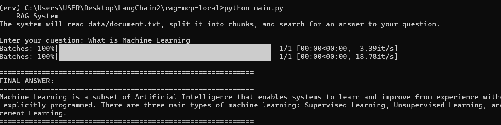

# RAG System with LangChain & Ollama

מערכת RAG (Retrieval-Augmented Generation) המשלבת LangChain agents, LLM מקומי (Ollama), ואחסון וקטורי (ChromaDB) למענה על שאלות מתוך מסמכים.

## תכונות עיקריות

- **ReAct Agent** - סוכן אוטונומי עם יכולת חשיבה ופעולה
- **LLM מקומי** - Ollama ללא שליחת מידע לשרתים חיצוניים
- **חיפוש סמנטי** - ChromaDB עם embeddings
- **Logging מובנה** - מעקב אחר פעולות המערכת

## התקנה

### 1. התקן Ollama
```bash
# הורד מ-https://ollama.ai
# הורד את מודל Mistral
ollama pull mistral
```

### 2. התקן תלויות Python
```bash
python -m venv env
env\Scripts\activate  # Windows
pip install -r requirements.txt
```

## שימוש

```bash
python main.py
```

המערכת תבקש ממך שאלה, תקרא את המסמך, ותחזיר תשובה מבוססת הקשר.

### דוגמת הרצה



## מבנה הפרויקט

```
rag-mcp-local/
├── data/document.txt      # מסמך לדוגמה
├── embeddings.py          # מודל embeddings
├── tools.py               # כלי MCP
├── rag_agent.py           # הגדרת Agent
├── main.py                # נקודת כניסה
└── requirements.txt       # תלויות
```

## איך זה עובד?

1. **קריאת מסמך** - הכלי `read_file` קורא את הקובץ
2. **חלוקה לחלקים** - הכלי `chunk_and_store` מפצל לחלקים של 500 תווים ושומר ב-ChromaDB
3. **חיפוש** - הכלי `search_document` מחפש את 3 החלקים הרלוונטיים ביותר
4. **מענה** - Ollama מייצר תשובה מבוססת הקשר

## התאמה אישית

### שינוי מודל LLM
ערוך `rag_agent.py`:
```python
llm = Ollama(model="mistral", temperature=0)
```

### שינוי גודל chunks
ערוך `tools.py`:
```python
max_chars = 500
```

## פתרון בעיות

**Ollama לא מגיב:**
```bash
ollama serve
```

**מודל לא נמצא:**
```bash
ollama pull mistral
```

## טכנולוגיות

- **LangChain** - framework לסוכנים
- **Ollama** - LLM מקומי
- **ChromaDB** - מסד נתונים וקטורי
- **Sentence Transformers** - embeddings

## רישיון

MIT License
